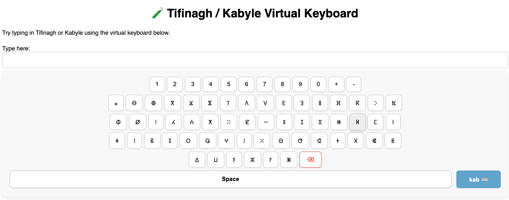

# Tifinagh / Kabyle Virtual Keyboard

A lightweight, mobile-friendly JavaScript virtual keyboard supporting **Tifinagh** and **Kabyle Latin-based scripts**, with Caps Lock, delete, layout switch, and responsive design.




## 🚀 Live Demo

https://kmerakeb.github.io/Virtual-Tif-Kab_Keyboard/

## ✨ Features

- Tifinagh & Kabyle keyboard layouts
- Caps (⇧) support for Kabyle layout
- Spacebar, delete, and layout switch
- Fully responsive (mobile-friendly)
- Zero dependencies
- Framework-agnostic (works with plain HTML, React, Vue, etc.)

## 📁 Usage

### 1. Clone or Download

```bash
git clone https://github.com/kmerakeb/Virtual-Tif-Kab_Keyboard.git.git
